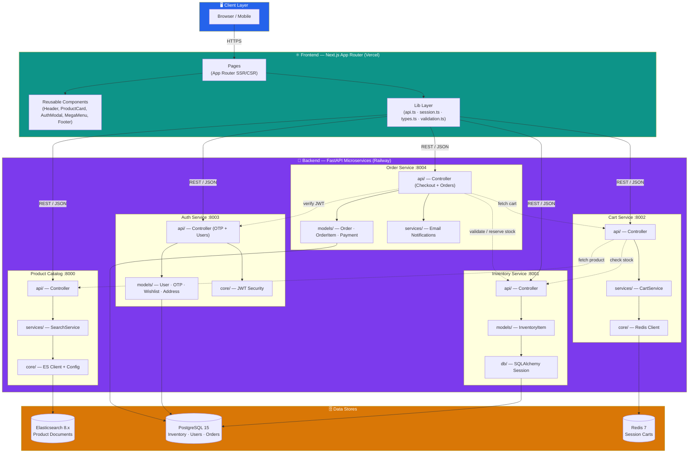

# Flipkart Clone

Flipkart-style ecommerce clone built with a Next.js storefront and FastAPI microservices for catalog, inventory, cart, auth, and orders.

## Design Philosophy — Why Microservices + MVC

Flipkart's own production platform is one of the largest microservice deployments in India — hundreds of independently owned services handling millions of concurrent users. This clone intentionally mirrors that architecture rather than shipping a monolith, because the goal is to demonstrate **production-grade scalability thinking**, not just feature completeness.

Decomposing the system into five bounded-context services (Product Catalog, Inventory, Cart, Auth, Orders) — each with its own data store, deployment unit, and failure boundary — shows that the design can scale horizontally the same way the real Flipkart platform does. Inside each service, a consistent **MVC-inspired layered structure** (`api/ → services/ → models/ → db/`) keeps the codebase maintainable as it grows: controllers stay thin, business logic lives in services, and models own persistence — exactly the pattern used by large engineering teams to onboard developers quickly and review code predictably.

---

## System Architecture



### MVC Mapping Per Microservice

Every backend service follows the same layered structure inspired by the **Model–View–Controller** pattern adapted for API-first services:

```
service/
├── app/
│   ├── api/          ← Controller   — FastAPI routers; request parsing, validation, HTTP responses
│   ├── models/       ← Model        — SQLAlchemy ORM classes (or ES mapping definition)
│   ├── schemas/      ← View / DTO   — Pydantic schemas for serialization & input validation
│   ├── services/     ← Service      — Pure business logic (search, cart ops, email)
│   ├── core/         ← Config       — Settings, DB/Redis/ES client bootstrap, JWT helpers
│   └── db/           ← Persistence  — Session factory, Base declarative class
```

| MVC Role | Package | Responsibility |
|---|---|---|
| **Controller** | `api/` | Receives HTTP requests, calls services, returns JSON |
| **Model** | `models/` | Defines database tables / document mappings |
| **View (DTO)** | `schemas/` | Shapes outgoing responses and validates incoming bodies |
| **Service** | `services/` | Encapsulates domain logic independent of HTTP or DB |
| **Config** | `core/` | Environment variables, client singletons, security |

---

## Why These Technologies

### Frontend — Next.js 15 (App Router)

| Decision | Rationale |
|---|---|
| **Next.js App Router** | Server-side rendering for the product listing and PDP pages gives fast first-paint and SEO; client components handle interactive cart/auth flows. |
| **TypeScript** | Strict types across API responses, session state, and component props catch integration bugs at compile time instead of at runtime. |
| **Vanilla CSS** | No dependency overhead from a utility framework; keeps the bundle lean and allows pixel-perfect Flipkart styling. |
| **`lib/api.ts` centralized client** | A single module wraps every backend call with typed generics, auth header injection, and error normalization — any service URL change is a one-line env var update. |
| **`lib/session.ts` localStorage session** | Lightweight client-side session with `CustomEvent` dispatching keeps the Header cart badge and auth state in sync across components without a global state library. |

### Backend — FastAPI + Uvicorn

| Decision | Rationale |
|---|---|
| **FastAPI** | Native `async/await` for all inter-service HTTP calls (cart → catalog, order → inventory); automatic OpenAPI docs at `/docs` on every service for evaluator convenience. |
| **Independent microservices** | Flipkart's real platform runs hundreds of microservices — this clone mirrors that philosophy by splitting into 5 bounded-context services that can start, fail, and scale independently. A cart Redis outage doesn't take down the product-browsing experience. |
| **Consistent MVC layering** | Using the same `api/ (Controller) → services/ (Business Logic) → models/ (Model) → db/ (Persistence)` skeleton across all five services makes onboarding and code review predictable — the same pattern large engineering teams at companies like Flipkart use to stay productive at scale. |

### Data Layer — "Right Tool for the Job"

| Store | Service | Why this store |
|---|---|---|
| **Elasticsearch 8.x** | Product Catalog | Full-text search with boosted fields (`title^3`, `description`), range filters for price/rating, and the `english` analyzer for stemming — SQL `LIKE` can't match this for a product listing page that needs instant faceted search. |
| **PostgreSQL 15** | Inventory, Auth, Orders | Relational integrity matters here: inventory reservations use `SELECT … FOR UPDATE` row locks to prevent overselling; orders reference items and payments with foreign keys; user → wishlist → addresses are classic relational associations. |
| **Redis 7** | Cart | Shopping carts are ephemeral, high-churn, session-scoped data. Redis hashes (`cart:{user_id}`) give O(1) field reads and writes with a built-in 7-day TTL expiry — no need to pollute a relational DB with throwaway session rows. |

### Auth — JWT + OTP

| Decision | Rationale |
|---|---|
| **OTP-based login** | Mirrors Flipkart's real phone/email OTP flow — no passwords to store or hash. Auto-signup on first OTP verification removes friction. |
| **JWT bearer tokens** | Stateless auth that every microservice can verify independently; the order service validates tokens by calling `auth-service/users/me` so it doesn't need a shared secret or database access. |
| **Default guest session** | A stable `default@flipkart.local` user is auto-created so the full checkout flow works without forcing the evaluator to log in. |

### Checkout — Saga-Style Compensation

The order service orchestrates checkout as a lightweight **saga** rather than a distributed transaction:

```
1.  Fetch cart          → cart-service
2.  Validate stock      → inventory-service
3.  Reserve inventory   → inventory-service  (point of no return)
4.  Write Order + Payment → local PostgreSQL  (atomic commit)
5.  Clear cart          → cart-service        (best-effort)
6.  Send confirmation   → email provider      (best-effort)
```

If step 4 fails after step 3 succeeds, a **compensating action** automatically releases the reserved inventory.  Steps 5 and 6 are fire-and-forget — a failed email or cart-clear doesn't roll back a confirmed order.

### Deployment — Vercel + Railway

| Decision | Rationale |
|---|---|
| **Vercel for frontend** | Zero-config Next.js hosting with edge CDN; the storefront is the public entry point so it benefits most from Vercel's global network. |
| **Railway for backend + data** | One platform for Python services, Postgres, Redis, and Elasticsearch; services communicate over Railway's private network, keeping latency low and traffic off the public internet. |
| **Two Railway projects** | `core-stack` (Postgres, ES, catalog, inventory, auth) and `checkout-stack` (Redis, cart, orders) isolate failure domains. A Redis restart doesn't affect product browsing. |

---

## Assignment Coverage

### Core features

- Product listing page with Flipkart-style product cards, search, category filtering, price filtering, and rating filtering
- Product detail page with multi-image gallery, merchandising offers, description/specifications, stock status, Add to Cart, and Buy Now
- Shopping cart with quantity updates, remove item, subtotal, discount view, and checkout entry
- Checkout flow with delivery address form, order summary review, payment option selection, order placement, and order confirmation page
- Public deployment suitable for evaluator testing

### Bonus features

- Responsive UI for desktop, tablet, and mobile layouts
- OTP-based login/signup flow on top of the default guest session
- Order history page
- Wishlist page backed by the auth service
- Order confirmation email support when provider credentials are configured

### Evaluator-friendly assumptions

- A stable default shopper session is created automatically so the app works even if login is skipped
- OTP is returned in the response for evaluator/demo convenience
- Payments are mocked as successful so the focus stays on the commerce flow
- The app is optimized for a one-day evaluation window using Vercel + Railway

---

## Services

| Service | Path | Default local port |
| --- | --- | --- |
| Frontend | `frontend` | `3000` |
| Product catalog | `product-catalog` | `8000` |
| Inventory | `inventory-service` | `8001` |
| Cart | `cart-service` | `8002` |
| Auth | `auth-service` | `8003` |
| Orders | `order-service` | `8004` |

## Local setup

### Infrastructure

```bash
docker-compose up -d
```

This starts PostgreSQL on `5433`, Redis on `6379`, and Elasticsearch on `9200`.

### Python services

Run each service in its own terminal:

```bash
cd product-catalog
python3 -m venv venv
source venv/bin/activate
pip install -r requirements.txt
uvicorn app.main:app --reload --port 8000
```

```bash
cd inventory-service
python3 -m venv venv
source venv/bin/activate
pip install -r requirements.txt
uvicorn app.main:app --reload --port 8001
```

```bash
cd cart-service
python3 -m venv venv
source venv/bin/activate
pip install -r requirements.txt
uvicorn app.main:app --reload --port 8002
```

```bash
cd auth-service
python3 -m venv venv
source venv/bin/activate
pip install -r requirements.txt
uvicorn app.main:app --reload --port 8003
```

```bash
cd order-service
python3 -m venv venv
source venv/bin/activate
pip install -r requirements.txt
uvicorn app.main:app --reload --port 8004
```

### Seed catalog and inventory

```bash
cd product-catalog
source venv/bin/activate
python seed_es.py
```

```bash
cd inventory-service
source venv/bin/activate
python sync_inventory.py
```

### Frontend

```bash
cd frontend
npm install
npm run dev
```

## One-day evaluation deployment

For the assignment evaluation window, the lowest-friction setup is:

- `frontend` on Vercel Hobby
- backend + infra on Railway Trial
- no refactor of the existing microservice split

This repo is set up for a one-day evaluator run, not a long-lived always-on free-tier deployment.

### Why this split

- Vercel handles the Next.js storefront with the least setup friction
- Railway Trial can host the Python services and data stores for the evaluation day
- keeping the current service boundaries avoids risky last-minute rewrites

### Railway project layout

Railway Trial is easiest to manage here as two separate projects.

`core-stack`

| Service | Root directory | Config file |
| --- | --- | --- |
| Postgres | Railway template | n/a |
| Elasticsearch | Railway template | n/a |
| Product catalog | `product-catalog` | `product-catalog/railway.json` |
| Inventory | `inventory-service` | `inventory-service/railway.json` |
| Auth | `auth-service` | `auth-service/railway.json` |

`checkout-stack`

| Service | Root directory | Config file |
| --- | --- | --- |
| Redis | Railway template | n/a |
| Cart | `cart-service` | `cart-service/railway.json` |
| Orders | `order-service` | `order-service/railway.json` |

Deploy the storefront separately from `frontend` on Vercel. Do not deploy the frontend to Railway for this evaluator setup.

If Railway is pointed at the repo root, set each service's Root Directory to the folder above and keep the matching `railway.json` inside that folder.

### Public domains

Generate Railway public domains for:

- `product-catalog`
- `inventory-service`
- `auth-service`
- `cart-service`
- `order-service`

The frontend calls these APIs directly from the browser, so they must be reachable over HTTPS.

### Environment variables

The examples below assume your Railway service names match the repo folder names exactly. If you rename a service in Railway, update the references accordingly.

#### Vercel (`frontend`)

- `NEXT_PUBLIC_CATALOG_URL=https://<product-catalog-domain>`
- `NEXT_PUBLIC_INVENTORY_URL=https://<inventory-domain>`
- `NEXT_PUBLIC_CART_URL=https://<cart-domain>`
- `NEXT_PUBLIC_AUTH_URL=https://<auth-domain>`
- `NEXT_PUBLIC_ORDERS_URL=https://<orders-domain>`

#### Railway `core-stack`

`product-catalog`

- `ELASTICSEARCH_URL=http://${{Elasticsearch.RAILWAY_PRIVATE_DOMAIN}}:9200`

`inventory-service`

- `DATABASE_URL=${{Postgres.DATABASE_URL}}`
- `ELASTICSEARCH_URL=http://${{Elasticsearch.RAILWAY_PRIVATE_DOMAIN}}:9200`

`auth-service`

- `DATABASE_URL=${{Postgres.DATABASE_URL}}`
- `JWT_SECRET_KEY=<strong random secret>`

#### Railway `checkout-stack`

`cart-service`

- `REDIS_URL=${{Redis.REDIS_URL}}`
- `PRODUCT_CATALOG_URL=https://<product-catalog-domain>`
- `INVENTORY_SERVICE_URL=https://<inventory-domain>`

`order-service`

- `DATABASE_URL=<public or external Postgres connection string from core-stack>`
- `CART_SERVICE_URL=https://<cart-domain>`
- `AUTH_SERVICE_URL=https://<auth-domain>`
- `INVENTORY_SERVICE_URL=https://<inventory-domain>`
- `ORDER_EMAIL_FROM=<verified sender address>`
- `ORDER_NOTIFICATION_TO_EMAIL=<fallback inbox for default-session orders, optional>`
- `EMAIL_PROVIDER=auto|resend|smtp`
- `RESEND_API_KEY=<required when using Resend>`
- `SMTP_HOST=<required when using SMTP>`
- `SMTP_PORT=587`
- `SMTP_USERNAME=<optional>`
- `SMTP_PASSWORD=<optional>`
- `SMTP_USE_TLS=true`

If the shopper is using the default assignment session, order emails go to `ORDER_NOTIFICATION_TO_EMAIL` when it is configured. OTP-logged-in shoppers receive emails at their own email address.

### Deploy order

Use this order so dependencies are ready before downstream services boot:

1. `core-stack` infra: Postgres, Elasticsearch
2. `core-stack` apps: `product-catalog`, `inventory-service`, `auth-service`
3. Seed data in Railway:
   - `product-catalog`: `python seed_es.py`
   - `inventory-service`: `python sync_inventory.py`
4. `checkout-stack` infra: Redis
5. `checkout-stack` apps: `cart-service`, `order-service`
6. `frontend` on Vercel with the final public API URLs

### Smoke test after deploy

The repo includes a smoke test script that exercises the deployed evaluator flow end to end.

Required env vars:

```bash
CATALOG_URL=https://<product-catalog-domain>
INVENTORY_URL=https://<inventory-domain>
CART_URL=https://<cart-domain>
AUTH_URL=https://<auth-domain>
ORDERS_URL=https://<orders-domain>
FRONTEND_URL=https://<vercel-frontend-domain>
```

Run it from the repo root:

```bash
node scripts/smoke-test.mjs
```

Optional OTP verification:

```bash
RUN_OTP_CHECK=1 node scripts/smoke-test.mjs
```

The smoke test validates:

- service health endpoints
- frontend availability
- default guest session bootstrap
- catalog search and product detail fetch
- inventory lookup
- add-to-cart and quantity update
- checkout and order retrieval
- optional OTP send/verify flow

## Assumptions

- The app silently bootstraps a default shopper session so the assignment works without forcing login
- OTP remains visible in the auth response for development/demo usage
- Payment is simulated and stored as a successful transaction
- Product carousel fallback slides are generated as SVG data URIs, not random placeholder images
